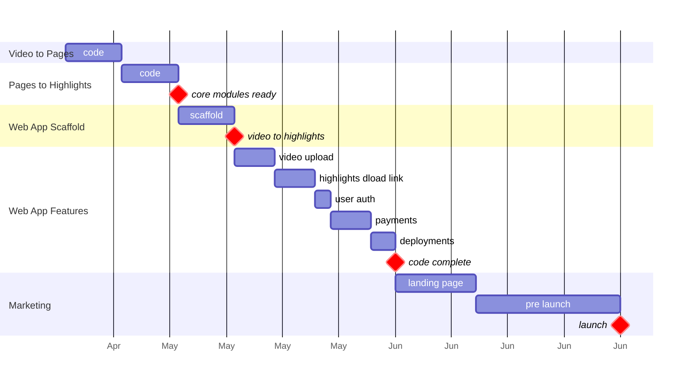

---
tags:
  - estimate-4h
status: DONE
---
[[Create JFS Reference]]

# 1. Always Consider Your Guest (Market Research)

- What do these people like? 
	- ==Reading physical books==
	- ==Preserving book highlights in digital format==
	- ==Reviewing highlights==
	- ==Tagging highlights==
	- ==Using highlights as references in their original work==
- What do they need? 
	- ==A *just works* System for capturing, organizing, referencing physical book highlights== 
	- ==HIghlight extraction speed > 500 pages/hour==
- What would be the worst fit for them? 
- What drives them crazy? 
	- ==Having to take pictures of individual highlights==
	- ==SW hanging up==
	- ==Poor customer support==
- What, metaphorically, makes their airways close up?
- What they never value enough to pay for.
- Learn what they do buy.
# 2. Set a deadline... and mean it

You need to know when you’ll be done. So pick a deadline. And mean it.
Finding that no matter how many deadlines you set, you never meet any of them? Refer back to that “Do you really want it?”

==Today is 2024-04-22.==
==Allowing ~39 days, this project should launch by, 2024-30-06==

# 3. Work backwards

you’ve got to set your “menu” in advance . Then you have your deadline

 put on your planning cap and draw your roadmap... in reverse.
 
## 3.1 Questions to ask for your backwards plan  
you have to figure out what you have to figure out.

– What’s the end result look like, exactly? 
	==- flipping book scan using camera on mobile/tablet==
	==- scan speed matching existing solutions==
	==- workflow + calibration in mobile app==
	==- newer ios only==
	==- yellow highlights extraction (just text highlights, notes/images not supported)==
	==- manual tagging of highlights==
	==- dumb FE, all cv in BE== 
– How many chapters/videos/features? 
	==- ios camera scanner FE (nice to have, v1 can be a video shot using tripod)==
	==- video to unique & complete pages (must)== 
	==- page images to text highlights (must)==
	==- highlight tagging (nice to have)==
	==- user authentication (must)==
	==- marketing/landing page (must)==
– What is absolutely required, what’s nice to have?
– How perfect does it have to be? 
	==- all yellow highlights should be captured across all pages==
	==- scan speed matching existing solutions==
– How long will each of these take? 
	==- 20 days - video to unique & complete pages (M1, must)== 
	==- 20 days - page images to text highlights (M2, must)==
	==- 10 days - integrate & test M1 with M2==
	==- 5 days - FE (web app) & BE (endpoints) scaffold==
	==- 5 days - video upload FE + BE== 
	==- 5 days - markdown highlights download link==
	==- 2 days - user authentication (must)==
	==- 5 days - payments==
	==- 10 days - marketing/landing page (must)==
	==- 3 days - deployments==
– What has to come first? 
	==- proof of concept==
	==- market research==
– What do I need to prepare? 
– How long will that take? 
– What do I need to find out?
– How long will that take? 
– How much, or how little, defines success? And who controls that?
	==- Solution should work & be available for purchase on a web app==
	==- No minimum revenue requirement==

# 4.Break it into pieces  

You’ll never read a menu plan that has you working on two or three dishes concurrently. But that’s the “natural” approach to working on a project by yourself: a little bit of this mixed up with a whole lotta that, in no particular order, no finish line in sight.  
**==Break it into stages. Instead of infinite choice, box yourself in a little. Or a lot.==**

That’s the power of a backwards plan

**Work on one thing at a time.**  
**feel the joy of accomplishment at completing one whole component in one go.**

==See tickets in Projects/Work/Highlights==

